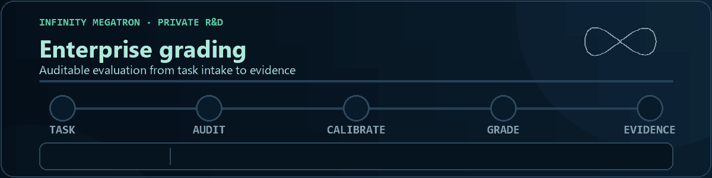

  

<strong>AI evaluation · verifier engineering · reproducible infrastructure</strong>

I build containerized benchmarks that make agent failures measurable, reproducible, and useful for improving evaluation systems.

  <a href="https://www.linkedin.com/in/numan-s-b622bb250/">LinkedIn</a> ·
  <a href="https://github.com/harbor-framework/terminal-bench/pull/1969">Terminal-Bench PR</a> ·
  <a href="https://github.com/search?q=is%3Apr+author%3ANuman5837&type=pullrequests">Open-source work</a>

## Selected work

### Terminal-Bench — replica reconciliation

I designed an open TB5 candidate that asks an agent to recover exact record drift from compressed replica sketches, choose one retry, and stay within a strict transfer budget.

**Validation:** [Docker passed](https://github.com/harbor-framework/terminal-bench/actions/runs/34815816471) · Oracle `1.0` · No-op `0.0` · GPT-5.6 Sol `0/5` with Terminus-2 via OpenRouter

<strong>What the model runs showed</strong>

All five trials completed without infrastructure errors. In the two trajectories analyzed in detail, the agent reused one global retry multiplier. That under-sized routed transition cases and overspent when the two routes drifted in opposite directions.

[View the PR](https://github.com/harbor-framework/terminal-bench/pull/1969) · [Read the failure analysis](https://github.com/harbor-framework/terminal-bench/pull/1969#issuecomment-5661777651)

### Infinity Megatron — enterprise grading

I built the enterprise grading layer for **Infinity Megatron**, a private AI-agent evaluation platform. The pipeline covers rubric-based artifact scoring, verifier audits, Docker calibration, Pass@k trials, mutation testing, and structured reports.

  

Private implementation; the animation shows the workflow at a high level.

### Gandalf the Grader — evaluator reliability

I submitted targeted patches for cross-platform process launching, UTF-8-safe I/O, Python 3.12 CI, and safe handling of malformed trajectories and judge responses.

[View the submitted patches](https://github.com/Handshake-AI-Research/gandalf-the-grader/pulls?q=is%3Apr+author%3ANuman5837)

## How I work

- Build expected results from verifier-controlled state.
- Prove the oracle passes and shortcut solutions fail.
- Isolate agent code from fixtures, answers, and rewards.
- Use failed trajectories to separate capability gaps from task defects.

## Tools

  

## Activity

  <picture>
    <source media="(prefers-color-scheme: dark)" srcset="https://raw.githubusercontent.com/Numan5837/Numan5837/output/github-contribution-grid-snake-dark.svg" />
    <source media="(prefers-color-scheme: light)" srcset="https://raw.githubusercontent.com/Numan5837/Numan5837/output/github-contribution-grid-snake.svg" />
    
  </picture>

