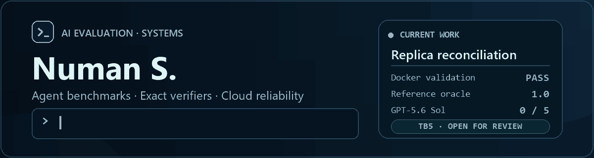

  

  
  
  

I build containerized benchmarks and verification tooling for AI agents. My focus is exact grading, adversarial testing, reproducible environments, and failure analysis that explains what an agent could not solve.

## Featured engineering

### Replica reconciliation under a transfer budget

My [Terminal-Bench contribution](https://github.com/harbor-framework/terminal-bench/pull/1969) asks an agent to recover exact record drift from compressed replica sketches while choosing a single retry within a strict transfer budget. It combines distributed-data reasoning, probabilistic decoding, process isolation, and verifier-owned ground truth.

| Check | Result |
|---|---:|
| Official Docker validation | Passed |
| Reference oracle | `1.0` |
| No-op agent | `0.0` |
| Terminus-2 + GPT-5.6 Sol via OpenRouter | `0/5` solved |

All five trials completed without infrastructure errors. In the first two trajectories I analyzed, the agent chose one global retry multiplier. It under-sized routed transition cases and exceeded the budget when the routing lanes drifted in opposite directions. That is the retry-sizing tradeoff this task tests.

[Review the open TB5 candidate](https://github.com/harbor-framework/terminal-bench/pull/1969) · [Official validation run](https://github.com/harbor-framework/terminal-bench/actions/runs/34815816471) · [Model-failure analysis](https://github.com/harbor-framework/terminal-bench/pull/1969#issuecomment-5661777651)

### Infinity Megatron

I built the enterprise grading layer inside **Infinity Megatron**, a private AI-agent evaluation platform. It combines rubric-based artifact scoring, verifier audits, Docker calibration, Pass@k model trials, mutation testing, and structured evaluation reports.

  

The implementation is kept in a private repository, so this profile describes the system without publishing its code or internal configuration.

### Evaluator reliability

I submitted a focused series of patches to [Gandalf the Grader](https://github.com/Handshake-AI-Research/gandalf-the-grader/pulls?q=is%3Apr+author%3ANuman5837), an evaluation tool for agent trajectories:

- Windows process launching, quick-start support, and Python 3.12 CI
- UTF-8-safe I/O and clearer judge-launch failures
- Graceful handling of malformed ATIF trajectories, judge output, batch entries, and invalid JSON

Each contribution is kept small enough to review independently and is clearly labeled as submitted work while it remains under review.

## How I approach evaluation work

- Derive expected results from verifier-controlled state.
- Keep task environments reproducible and self-contained.
- Prove the oracle passes and empty or shortcut solutions fail.
- Isolate agent code from fixtures, answers, and reward files.
- Read failed trajectories and distinguish capability gaps from task defects.

## Toolbox

  

  
  

## Current focus

I am working on hard, realistic terminal-agent tasks and the infrastructure needed to evaluate them reliably. I am interested in AI evaluation, distributed systems, developer infrastructure, and cloud reliability.

## Contribution activity

  <picture>
    <source media="(prefers-color-scheme: dark)" srcset="https://raw.githubusercontent.com/Numan5837/Numan5837/output/github-contribution-grid-snake-dark.svg" />
    <source media="(prefers-color-scheme: light)" srcset="https://raw.githubusercontent.com/Numan5837/Numan5837/output/github-contribution-grid-snake.svg" />
    
  </picture>

Generated daily from my public GitHub contribution graph.

  <a href="https://www.linkedin.com/in/numan-s-b622bb250/">LinkedIn</a>
  ·
  <a href="https://github.com/Numan5837?tab=repositories">Repositories</a>
  ·
  <a href="https://github.com/search?q=is%3Apr+author%3ANuman5837&type=pullrequests">Contributions</a>

