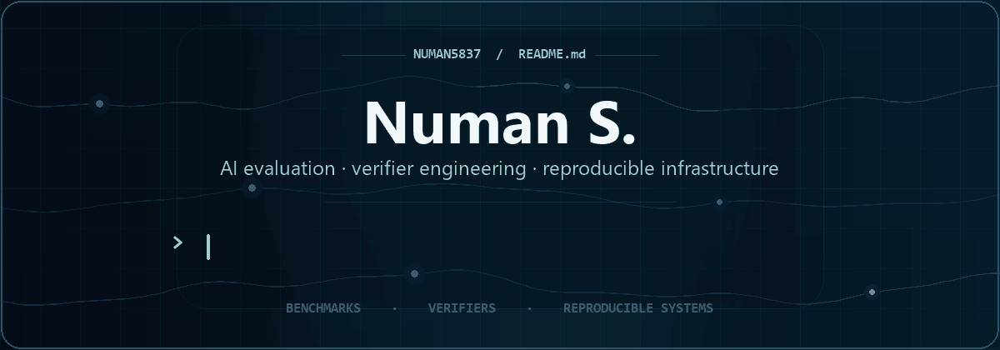

  

   

  
<strong>AI EVALUATION &nbsp;·&nbsp; VERIFIER ENGINEERING &nbsp;·&nbsp; REPRODUCIBLE INFRASTRUCTURE</strong>

  
I build containerized benchmarks that make agent failures measurable, reproducible, and useful for improving evaluation systems.

   

  

    &nbsp;
    &nbsp;
    
  

 

## Selected work

BENCHMARK DESIGN &nbsp;·&nbsp; EVALUATION SYSTEMS &nbsp;·&nbsp; RELIABLE INFRASTRUCTURE

### Replica reconciliation

**Terminal-Bench** &nbsp;·&nbsp; OPEN TB5 CANDIDATE

I designed a database reliability task that asks an agent to recover exact record drift from compressed replica sketches, choose one retry, and stay within a strict transfer budget.

> **Validation** &nbsp; [Docker passed](https://github.com/harbor-framework/terminal-bench/actions/runs/34815816471) &nbsp;·&nbsp; Oracle `1.0` &nbsp;·&nbsp; No-op `0.0` &nbsp;·&nbsp; GPT-5.6 Sol `0/5` with Terminus-2 via OpenRouter

**[View the pull request →](https://github.com/harbor-framework/terminal-bench/pull/1969)** &nbsp;&nbsp; [Read the failure analysis](https://github.com/harbor-framework/terminal-bench/pull/1969#issuecomment-5661777651)

<strong>Model-run notes</strong>

 

All five trials completed without infrastructure errors. In the two trajectories analyzed in detail, the agent reused one global retry multiplier. That under-sized routed transition cases and overspent when the two routes drifted in opposite directions.

---

### Enterprise grading

**Infinity Megatron** &nbsp;·&nbsp; PRIVATE R&amp;D

I built the enterprise grading layer for **Infinity Megatron**, a private AI-agent evaluation platform. The pipeline covers rubric-based artifact scoring, verifier audits, Docker calibration, Pass@k trials, mutation testing, and structured reports.

 

  

Private implementation &nbsp;·&nbsp; The animation presents the workflow at a high level

---

### Evaluator reliability

**Gandalf the Grader** &nbsp;·&nbsp; OPEN-SOURCE ENGINEERING

I submitted targeted patches for cross-platform process launching, UTF-8-safe I/O, Python 3.12 CI, and safe handling of malformed trajectories and judge responses.

**[View the submitted patches →](https://github.com/Handshake-AI-Research/gandalf-the-grader/pulls?q=is%3Apr+author%3ANuman5837)**

## How I work

- **Build from controlled state.** Derive expected results from data held by the verifier.
- **Test both sides.** Prove the oracle passes and shortcut solutions fail.
- **Protect the evaluation.** Isolate agent code from fixtures, answers, and rewards.
- **Study the failures.** Use trajectories to separate capability gaps from task defects.

## Technical toolkit

  

## Contribution activity

  <picture>
    <source media="(prefers-color-scheme: dark)" srcset="https://raw.githubusercontent.com/Numan5837/Numan5837/output/github-contribution-grid-snake-dark.svg" />
    <source media="(prefers-color-scheme: light)" srcset="https://raw.githubusercontent.com/Numan5837/Numan5837/output/github-contribution-grid-snake.svg" />
    
  </picture>

