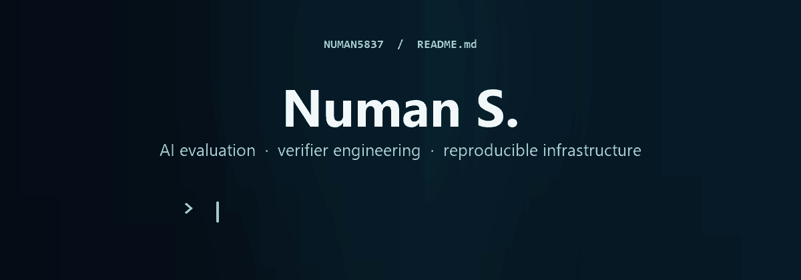
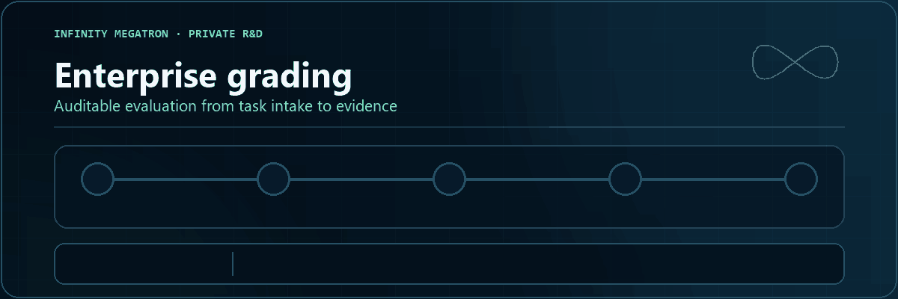

  

   

  
I build containerized benchmarks that make agent failures measurable, reproducible, and useful for improving evaluation systems.

  

    &nbsp;
    &nbsp;
    
  

## 01 / From challenge to evidence

I work from a difficult agent task to the evidence needed to trust its result. The projects below follow that same path: design the challenge, build the grading system, then harden the evaluator.

> **The path:** design → calibrate → grade → analyze → harden

### Step 01 · Design the challenge

**Terminal-Bench — replica reconciliation** &nbsp;·&nbsp; `OPEN TB5 CANDIDATE`

I designed a database reliability task that asks an agent to recover exact record drift from compressed replica sketches, choose one retry, and stay within a strict transfer budget.

**Validation:** [Docker validation passed](https://github.com/harbor-framework/terminal-bench/actions/runs/34815816471) &nbsp;·&nbsp; Oracle `1.0` &nbsp;·&nbsp; No-op `0.0` 
**Model trials:** GPT-5.6 Sol with Terminus-2 via OpenRouter &nbsp;·&nbsp; `0/5`

**[View the pull request →](https://github.com/harbor-framework/terminal-bench/pull/1969)** &nbsp;&nbsp; [Read the failure analysis](https://github.com/harbor-framework/terminal-bench/pull/1969#issuecomment-5661777651)

<strong>What the model runs showed</strong>

 

All five trials completed without infrastructure errors. In the two trajectories analyzed in detail, the agent reused one global retry multiplier. That under-sized routed transition cases and overspent when the two routes drifted in opposite directions.

*Once the challenge is calibrated, the next problem is making its grading repeatable.*

### Step 02 · Build the grading pipeline

**Infinity Megatron — enterprise grading** &nbsp;·&nbsp; `PRIVATE R&D`

I built the enterprise grading layer for **Infinity Megatron**, a private AI-agent evaluation platform. The pipeline covers rubric-based artifact scoring, verifier audits, Docker calibration, Pass@k trials, mutation testing, and structured reports.

  

Private implementation &nbsp;·&nbsp; The animation presents the workflow at a high level.

*A repeatable grading pipeline still depends on an evaluator that fails safely.*

### Step 03 · Harden the evaluator

**Gandalf the Grader — evaluator reliability** &nbsp;·&nbsp; `OPEN-SOURCE ENGINEERING`

I submitted targeted patches for cross-platform process launching, UTF-8-safe I/O, Python 3.12 CI, and safe handling of malformed trajectories and judge responses.

**[View the submitted patches →](https://github.com/Handshake-AI-Research/gandalf-the-grader/pulls?q=is%3Apr+author%3ANuman5837)**

## 02 / The evaluation loop

Across these projects, I use one repeatable process:

1. **Frame the capability.** Define the behavior being tested and the exact completion condition.
2. **Build from controlled state.** Derive expected results from data held by the verifier.
3. **Calibrate both sides.** Prove the oracle passes and shortcut or no-op solutions fail.
4. **Protect the evaluation.** Isolate agent code from fixtures, answers, and rewards.
5. **Study and harden.** Use trajectories to separate capability gaps from task defects, then improve the evaluator.

## 03 / Toolkit

| Evaluate | Reproduce | Automate |
| --- | --- | --- |
| Exact verifiers · Pass@k trials · trajectory analysis | Docker · Linux · Kubernetes · AWS | Python · Bash · PowerShell · GitHub Actions |

  

## 04 / Activity

The public part of this work continues through benchmark and evaluator pull requests.

  <picture>
    <source media="(prefers-color-scheme: dark)" srcset="https://raw.githubusercontent.com/Numan5837/Numan5837/output/github-contribution-grid-snake-dark.svg" />
    <source media="(prefers-color-scheme: light)" srcset="https://raw.githubusercontent.com/Numan5837/Numan5837/output/github-contribution-grid-snake.svg" />
    
  </picture>

---

  
<strong>Interested in difficult agent evaluations, exact verifiers, and the infrastructure behind trustworthy scores.</strong>

  
<a href="https://www.linkedin.com/in/numan-s-b622bb250/">If you are working on the same problems, I would be glad to compare approaches →</a>

